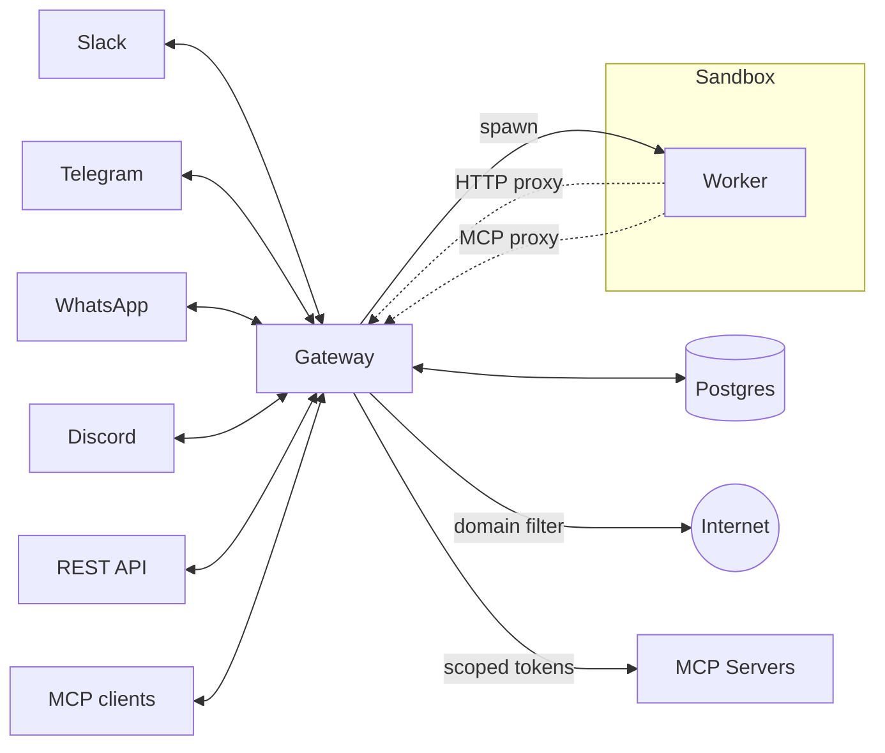

# Lobu — Open-source backend for AI teammates

**Lobu** is open-source infrastructure for autonomous agents that **watch**, **remember**, and **act** where your team already works. Connect company tools, build living memory, and let agents run on schedules, in Slack threads, or over MCP — with sandboxed execution per user or channel and credentials agents never see.

Under the hood, workers run an [OpenClaw](https://openclaw.ai/)-style agent loop (bash, files, MCP tools, skills) inside an isolated sandbox per conversation. One Node process serves many agents and channels; shared memory and connectors live in Postgres (pgvector). Embed agents in your product, or give your team their own without running a separate instance per person.

https://github.com/user-attachments/assets/d72a9286-0325-4b8b-afc0-c1efe9c96f4e

## Two ways in

### 1. Full agent — Slack, Telegram, watchers, connectors

Scaffold and run locally with the CLI. Lobu boots as a single Node process with zero-config embedded Postgres by default (or bring your own — pgvector required — via `DATABASE_URL`). `lobu run` opens the web UI on `:8787` and can wire Slack via the hosted bot or your own app.

```bash
npx @lobu/cli@latest init my-bot
cd my-bot
npx @lobu/cli@latest run                      # boots the stack and applies your agent
npx @lobu/cli@latest chat -c local "hello"    # talk to it
```

`lobu run` auto-applies your `lobu.config.ts`, so the scaffolded agent is usable immediately. To use an external Postgres, set `DATABASE_URL` in `.env`; to push later config changes, run `lobu apply`.

Next steps: [Getting started](https://lobu.ai/getting-started/) (project layout, develop with your coding agent, evals) · [Memory](https://lobu.ai/getting-started/memory/) · [Skills](https://lobu.ai/getting-started/skills/) · [Channels](#channels)

### 2. Memory for Claude Code (and Claude Desktop)

Give Claude durable, structured memory via MCP — the same graph your Lobu agents use. Full setup: [Connect from Claude](https://lobu.ai/connect-from/claude/).

```bash
claude mcp add --transport http lobu https://lobu.ai/mcp   # or http://localhost:8787/mcp locally
```

Complete the OAuth flow when prompted, then enable the connector. Pair it with a project instruction or skill that tells Claude when to search memory and when to save what it learned.

Works the same for [ChatGPT](https://lobu.ai/connect-from/chatgpt/) and [OpenClaw](https://lobu.ai/connect-from/openclaw/) — one memory backend across clients.

## Architecture



## Capabilities

Most agent stacks treat MCP as the memory: every turn, the agent calls GitHub, Slack, and CRM tools to reconstruct what happened. That knowledge stays siloed in the session and disappears when the chat ends.

Lobu runs a **data pipeline** instead. Connectors poll and webhooks push into one durable, append-only event log. Watchers and chat agents read the same org-scoped knowledge graph — typed entities, relationships, searchable events — so anyone can resume where the organization left off, not where one conversation left off.

### Memory — ingest, entities, watchers

**Ingest.** [Connectors](https://lobu.ai/sdks/connectors/) pull on a schedule; webhooks and the [REST API](https://lobu.ai/sdks/rest-api/) push. Stripe charges, GitHub PRs, form submissions, and connector polls all land as rows in the same log — a stable record of what happened in the world, not something the agent has to re-fetch through MCP every turn.

**Entities.** You define the schema (`Company`, `Project`, `Incident`, …) in `lobu.config.ts`. Events attach to entity instances (`Company:Acme`) and build a live knowledge graph the whole org shares. Corrections supersede old facts; nothing is deleted, so provenance and time-travel stay intact.

**Watchers.** Standing goals on a cron or tight interval: read new rows in the log (including webhook-fed events like `pull_request.opened`), extract structured memory onto dynamic entities, and optionally run a [reaction](https://lobu.ai/sdks/reactions/) to notify Slack, open a ticket, or kick off agent work — while nobody is in chat.

Docs: [Memory](https://lobu.ai/getting-started/memory/) · [Connectors](https://lobu.ai/sdks/connectors/) · [Reactions](https://lobu.ai/sdks/reactions/)

### Agents — read the graph, branch to act

Chat agents **look up** what the pipeline already captured — search entities, read the event log, pull thread history — then **branch** into an isolated sandbox ([just-bash](https://www.npmjs.com/package/just-bash) + Nix) to run bash, edit files, and call MCP tools for side effects. MCP is for *doing*; the knowledge graph is for *knowing*. Pick any of [16 LLM providers](https://lobu.ai/reference/providers/); credentials stay on the gateway.

Behavior comes from a **role file model** — `IDENTITY.md` (who), `SOUL.md` (rules), `USER.md` (context). **Guardrails** gate input, output, and tool calls (`secret-scan`, `pii-scan`, inline LLM judges) so policy holds even when the prompt doesn't. Destructive MCP calls wait for in-thread approval; every action writes back to the log.

Docs: [Agent workspace](https://lobu.ai/guides/agent-prompts/) · [Guardrails](https://lobu.ai/guides/guardrails/) · [Security](https://lobu.ai/guides/security/)

### Channels

One instance serves **Slack, Telegram, WhatsApp, Discord, Teams, Google Chat**, and a [REST API](https://lobu.ai/reference/api-reference/) [](https://lobu.ai/reference/api-reference/). Each channel/DM gets its own runtime, model, tools, credentials, and Nix packages. Platform setup: [Slack](https://lobu.ai/platforms/slack/) · [Telegram](https://lobu.ai/platforms/telegram/) · [Discord](https://lobu.ai/platforms/discord/) · [WhatsApp](https://lobu.ai/platforms/whatsapp/) · [Teams](https://lobu.ai/platforms/teams/) · [Google Chat](https://lobu.ai/platforms/google-chat/).

## How Lobu Differs

Lobu is the **infrastructure layer** for autonomous agents. Frameworks like LangChain or CrewAI help you *write* agent logic; Lobu is the delivery layer that runs those agents at scale — sandboxing, persistence, and messaging connectivity.

**vs OpenClaw:** OpenClaw is [single-tenant by design](https://x.com/steipete/status/2026092642623201379) — every user shares the same filesystem and bash session. Lobu keeps the same autonomous loop but runs it **multi-tenant**: one gateway, an isolated sandbox per channel or DM, and org-scoped memory your whole team can share. Full write-up: [lobu.ai/getting-started/comparison](https://lobu.ai/getting-started/comparison/).

| | Lobu | Claude Tag | OpenClaw |
| --- | --- | --- | --- |
| Tenancy | Multi-tenant — per-channel/DM isolation | Per-channel @Claude | Single-tenant — one shared runtime |
| Open source / self-host | Yes | No | Yes |
| Model choice | 16 providers | Claude only | Per setup |
| Multi-platform | Slack, Telegram, WhatsApp, Discord, Teams, Google Chat, REST API, MCP | Slack (beta) | [15+ chat platforms](https://openclaw.ai/integrations) |
| Custom connectors / watchers | Yes (`lobu.config.ts`) | Admin-provisioned tools | Skills + local setup |
| Secrets & network | Gateway proxy, domain-filtered egress | Managed | Direct from agent, no built-in isolation |

## Agent configuration

Runtime configuration is managed through the web app or the same org-scoped REST API used by the CLI. See the [CLI reference](https://lobu.ai/reference/cli/) and [`lobu apply`](https://lobu.ai/reference/lobu-apply/).

```bash
npx @lobu/cli@latest login
npx @lobu/cli@latest org set my-org
npx @lobu/cli@latest agent list
```

Local `lobu.config.ts` projects are still useful for `lobu validate` and `lobu apply` workflows.

## Deployment

The quick start above is the fastest path. For production self-hosting, see the [deployment docs](https://lobu.ai/deployment/docker/): [Docker](https://lobu.ai/deployment/docker/) · [Cloud](https://lobu.ai/deployment/cloud/) · [Kubernetes](https://lobu.ai/deployment/kubernetes/).

## Security and Privacy

Secrets, egress policy, and MCP credential injection stay on the gateway; each worker runs in an isolated sandbox per channel or DM. Guides: [Security](https://lobu.ai/guides/security/) · [Secret proxy](https://lobu.ai/guides/secret-proxy/) · [Guardrails](https://lobu.ai/guides/guardrails/) · [threat model](docs/SECURITY.md).

- [**Worker egress through the gateway proxy**](https://lobu.ai/guides/security/#network-isolation) — `HTTP_PROXY=http://localhost:8118` with domain allowlist/blocklist and an optional [LLM egress judge](https://lobu.ai/guides/egress-judge/) for ambiguous hosts. On Linux production, worker spawn uses `systemd-run --user --scope` with `IPAddressDeny=any` to enforce egress at the kernel; on macOS dev the proxy is best-effort.
- [**Secrets stay in the gateway**](https://lobu.ai/guides/secret-proxy/) — provider credentials and `${env:}` substitution; OAuth and MCP tokens live in Lobu. Workers get opaque placeholders; the secret proxy swaps real values at egress. Workers never see API keys or refresh tokens.
- [**Threat model**](https://lobu.ai/guides/security/) — `just-bash` and `isolated-vm` are policy + best-effort sandboxes, not security boundaries for hostile code. Read [docs/SECURITY.md](docs/SECURITY.md) before exposing Lobu to untrusted users.
- [**Nix system packages**](docs/SECURITY.md#skills-and-policy) — per-agent reproducible tooling and skill policy via `runtime.nix.packages` and `lobu.config.ts`.

## Support & Consultancy

Lobu is open source, but deploying production-grade agents usually means tuning soul, identity, and integrations. I offer hands-on implementation for:

- **Employee AI assistants** — persistent sandboxed agents on Slack wired into internal tools and docs.
- **Automated customer support** — multi-step ticket handling with human-in-the-loop.
- **Autonomous workflows** — long-running, scheduled background jobs with persistent state.
- **Managed infrastructure** — private Lobu deployments with updates and scaling.
- **Custom tooling & skills** — bespoke MCP servers, Nix runtimes, and agent skills.

I'm a second-time technical founder. Previously founded [rakam.io](https://rakam.io) (enterprise analytics PaaS), acquired by [LiveRamp](https://liveramp.com) (NYSE: RAMP).

> [!TIP]
> Want persistent agents for your team or customers? [Talk to Founder](https://calendar.app.google/LwAk3ecptkJQaYr87) or reach out on [X/Twitter](https://x.com/bu7emba).