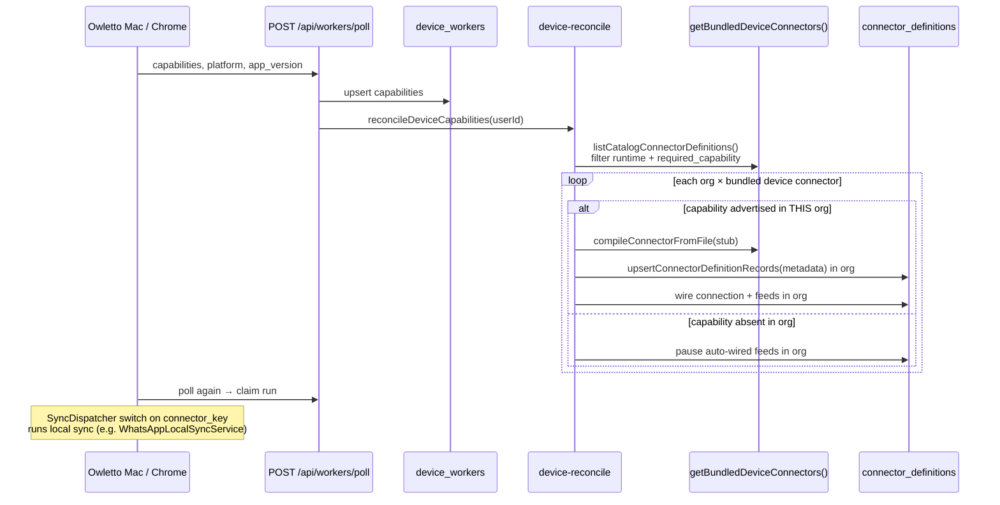

# Device-owned connector manifests at poll time

**Author:** design-doc-writer (draft)  
**Date:** 2026-07-02  
**Status:** Draft (revised per review)  
**Related:** Unbundle PR #1692 (cloud connectors unbundled; device bridges stay bundled for now)

---

## Overview

Today, eleven **device-bound** connectors (`BridgeOnlyConnector` stubs in `packages/connectors/src/`) declare metadata (feeds, entityLinks, `requiredCapability`, `runtime`) that is compiled from the server image at **device-reconcile** time. The Mac/Chrome apps implement the real `sync()` locally but must keep their connector metadata in lockstep with server-side stubs — a coupling that blocks the unbundle goal for device bridges.

This design moves **connector definition ownership to the device**: Mac and Chrome apps register **connector manifests** on every `POST /api/workers/poll`. The gateway validates, stores per-device snapshots (keyed by `manifest_hash` for drift detection), and **device-reconcile** upserts org-scoped `connector_definitions` from those manifests instead of recompiling bundled `.ts` stubs. Bundled stubs remain a **fallback** until a minimum app version threshold is met fleet-wide.

**Reconcile scope:** Manifest merge and version pick are **per `organization_id`**, matching today's `device-reconcile.ts` loop (`orgsWithDevices.flatMap`). A device in org A never influences `connector_definitions` in org B.

---

## Background & Motivation

### Current architecture



**Pain points:**

| Pain | Detail |
|------|--------|
| **Dual maintenance** | Connector metadata lives in `packages/connectors/src/*.ts` stubs *and* native sync code (`AppState.swift` switch, Chrome `feeds-*.js`). Adding a feed or entityLink requires a server deploy. |
| **Unbundle blocker** | PR #1692 intentionally keeps device stubs bundled; they are the only source of truth for auto-wire. |
| **Drift invisible** | A Mac app shipping updated entityLinks (e.g. `whatsapp.local` `createWhen` tweak) does not update `connector_definitions` until the server image picks up the stub change. |
| **Hardcoded UI** | `CAPABILITY_LABELS` in `packages/owletto/src/components/devices/device-display.tsx` maps only Mac capabilities; Chrome `browser.*` strings are raw until PR-7. |
| **Dispatch coupling** | `SyncDispatcher` in `AppState.swift` hardcodes `connector_key → sync service` separately from capability advertisement in `currentCapabilities`. |

### Affected bundled stubs (11)

| Connector key | `requiredCapability` | Platform |
|---------------|------------------------|----------|
| `whatsapp.local` | `whatsapp_local` | macos |
| `apple.screen_time` | `screentime` | macos |
| `apple.health` | `healthkit` | macos |
| `apple.photos` | `photos` | macos |
| `apple.calendar` | `calendar` | macos |
| `apple.reminders` | `reminders` | macos |
| `apple.system_audio` | `system_audio` | macos |
| `local.directory` | `local_directory` | macos |
| `chrome.history` | `browser.history` | chrome-extension |
| `chrome.bookmarks` | `browser.bookmarks` | chrome-extension |
| `chrome.downloads` | `browser.downloads` | chrome-extension |

Cloud-side `BridgeOnlyConnector.sync()` always throws — only a safety net if capability gating fails (`packages/connector-sdk/src/connector-runtime.ts`).

---

## Goals & Non-Goals

### Goals

1. Devices **own** connector metadata for bridges they implement; server **validates and persists**, never trusts blindly.
2. **`manifest_hash` on every poll** to detect per-device drift (Fable review recommendation).
3. **device-reconcile** wires connectors from **poll-registered manifests** (per org), with bundled-stub fallback during rollout.
4. Preserve existing behavior: capability gating (`@lobu/core/capabilities.ts`), advisory-lock idempotency, feed pause on capability revoke, device pin semantics, `userManaged` feed exclusion.
5. **Multi-replica safe**: per-device poll is independent; reconcile uses existing `pg_advisory_xact_lock(hashtext('lobu:autowire'), …)`.

### Non-Goals

- Moving native **sync implementation** off-device (still Mac Swift / Chrome JS).
- Removing `SyncDispatcher` connector-key routing in this project (follow-up: registry keyed by manifest).
- Unbundling cloud connectors (already addressed by #1692).
- Shipping compiled connector **code** from devices (manifests are JSON metadata only; `compiled_code` stays `null` for device connectors).
- Changing poll claim / credential delivery semantics.

---

## Proposed Design

### High-level architecture

```mermaid
flowchart TB
    subgraph Device["Device (Mac / Chrome)"]
        M[Embedded manifest JSON<br/>per connector_key]
        P[Poll loop]
        S[Local sync services]
    end

    subgraph Gateway["Lobu gateway (any replica)"]
        V[validateDeviceConnectorManifests]
        H[computeManifestHash / compare drift]
        DW[(device_workers.connector_manifests)]
        R[device-reconcile per org]
        CD[(connector_definitions per org)]
    end

    M --> P
    P -->|connector_manifests[]| V
    V --> H
    H --> DW
    P --> R
    R -->|read manifests from fresh devices IN org| DW
    R -->|fallback per org if no manifest| BUNDLED[bundled catalog stubs]
    R --> CD
    P -->|claim run| S
```

### Manifest schema

A **device connector manifest** is a JSON object — structurally a subset of `ConnectorDefinition` (`packages/connector-sdk/src/connector-types.ts`) with fields the gateway needs for catalog + auto-wire. It is **not** executable code.

Poll wire format uses **snake_case** keys (HTTP JSON convention). Server maps to camelCase `ConnectorMetadata` before upsert (see mapping table below).

```typescript
/** packages/core/src/device-connector-manifest.ts (proposed) */
export interface DeviceConnectorManifest {
  key: string;
  version: string;
  name: string;
  description?: string;
  favicon_domain?: string;
  required_capability: string;
  runtime: {
    /** PR-1 extends ConnectorRuntimeInfo to include 'chrome-extension'. */
    platforms: Array<
      'ios' | 'android' | 'macos' | 'windows' | 'linux' | 'chrome-extension'
    >;
    scopes?: string[];
    nix?: { packages: string[] };
  };
  feeds_schema: Record<string, FeedDefinitionManifest>;
  actions_schema?: Record<string, ActionDefinitionManifest>;
  auth_schema?: { methods: Array<{ type: 'none' }> };
  manifest_hash: string;
}
```

#### `chrome-extension` platform typing (resolved)

**Decision:** Extend `ConnectorRuntimeInfo.platforms` and `ConnectorMetadata.runtime` in **PR-1** to include `'chrome-extension'`. Remove the `as unknown as ['macos']` cast from chrome stubs at export time. Manifest validation requires `runtime.platforms` to include the polling device's effective platform (`macos` or `chrome-extension`).

#### `manifest_hash` computation

1. Build **`hash_payload`** with keys in **lexicographic order** at every object level (recursive sort).
2. Include only: `key`, `version`, `name`, `description?`, `favicon_domain?`, `required_capability`, `runtime`, `feeds_schema`, `actions_schema?`, `auth_schema?` (omit `manifest_hash`).
3. Normalize: trim strings; omit absent optional fields; sort `feeds_schema` feed keys and nested `eventKinds` keys.
4. `manifest_hash = sha256(JSON.stringify(hash_payload)).hex` — UTF-8, compact JSON, no whitespace.

**Golden vectors (merge gate):** Shared fixtures in `packages/core/src/__fixtures__/device-manifest-hashes.json`, consumed by:

- Server unit tests (PR-1)
- Mac unit tests (PR-5) — must match or poll entries are dropped server-side
- Chrome unit tests (PR-6)

At minimum: `whatsapp.local@0.1.0`, `local.directory@0.1.0`, `chrome.history@0.1.0`. CI fails if any client hash diverges.

**Valid excerpt (`whatsapp.local`):**

```json
{
  "key": "whatsapp.local",
  "version": "0.1.0",
  "name": "WhatsApp (this Mac)",
  "description": "Reads messages from the WhatsApp Desktop app's local archive on this Mac.",
  "favicon_domain": "whatsapp.com",
  "required_capability": "whatsapp_local",
  "runtime": { "platforms": ["macos"] },
  "auth_schema": { "methods": [{ "type": "none" }] },
  "feeds_schema": {
    "messages": {
      "key": "messages",
      "name": "Messages",
      "configSchema": { "type": "object", "properties": {} },
      "eventKinds": {
        "message": {
          "metadataSchema": { "type": "object", "properties": { "source": { "type": "string" } } },
          "entityLinks": [
            {
              "entityType": "person",
              "autoCreate": true,
              "createWhen": { "path": "metadata.is_group", "equals": false },
              "identities": [{ "namespace": "wa_jid", "eventPath": "metadata.sender_jid" }]
            }
          ]
        }
      }
    }
  },
  "manifest_hash": "<computed by golden fixture>"
}
```

Full canonical manifest: `packages/core/src/__fixtures__/device-manifest-hashes.json` (added in PR-1).

---

### Manifest → `ConnectorMetadata` mapping

```typescript
/** packages/server/src/worker-api/device-manifest-adapter.ts */
function deviceManifestToConnectorMetadata(
  manifest: DeviceConnectorManifest,
): ConnectorMetadata {
  return {
    key: manifest.key,
    name: manifest.name,
    description: manifest.description,
    version: manifest.version,
    kind: 'data',
    requiredCapability: manifest.required_capability,
    faviconDomain: manifest.favicon_domain ?? null,
    runtime: manifest.runtime, // includes chrome-extension after PR-1
    authSchema: manifest.auth_schema ?? { methods: [{ type: 'none' }] },
    feeds: manifest.feeds_schema,       // verbatim — same nesting as compiled metadata.feeds
    actions: manifest.actions_schema ?? null,
    optionsSchema: null,
    webhook: null,
    mcpConfig: null,
    openapiConfig: null,
  };
}
```

| Manifest field (snake_case) | `ConnectorMetadata` field (camelCase) | `connector_definitions` column |
|-----------------------------|---------------------------------------|--------------------------------|
| `key` | `key` | `key` |
| `name` | `name` | `name` |
| `description` | `description` | `description` |
| `version` | `version` | `version` |
| `favicon_domain` | `faviconDomain` | `favicon_domain` |
| `required_capability` | `requiredCapability` | `required_capability` |
| `runtime` | `runtime` | `runtime` |
| `auth_schema` | `authSchema` | `auth_schema` |
| `feeds_schema` | `feeds` | `feeds_schema` |
| `actions_schema` | `actions` | `actions_schema` |
| — | `kind: 'data'` | — |
| `manifest_hash` | stored separately | `definition_manifest_hash` (new column, PR-4) |

`feeds_schema` eventKinds + entityLinks nest **identically** to `ConnectorDefinition.feeds` / compiled `metadata.feeds` — no transform beyond the field rename on the parent object.

#### `feedKeys` extraction (matches `getBundledDeviceConnectors`)

```typescript
function manifestFeedKeys(manifest: DeviceConnectorManifest): string[] {
  return Object.entries(manifest.feeds_schema)
    .filter(([, def]) => !def?.userManaged)
    .map(([key]) => key);
}
```

`local.directory` has only `files` with `userManaged: true` → `feedKeys = []`. Fast path treats connection + definition as ready once installed (same as today). Auto-wire **never** inserts userManaged feeds; Mac/Chrome mint them via `/api/workers/me/feeds`.

---

### Poll API changes

#### Request (`POST /api/workers/poll`)

Additive field `connector_manifests?: DeviceConnectorManifest[]`.

#### `connector_manifests` persistence semantics

Reconcile reads **persisted** `device_workers.connector_manifests`, never the ephemeral poll body.

| Poll body | `connector_manifests` column update |
|-----------|-------------------------------------|
| Field **omitted** (old clients) | **No change** — preserve last valid snapshot |
| **`[]` empty array** | **Clear** — set to `'{}'::jsonb` |
| **Non-empty array** | Merge: replace keys present in payload; keys absent from payload but previously stored are **retained** (partial update). To drop a key, client sends explicit tombstone in a future revision; v1 clients send the full implemented set every poll. |

**Processing order:**

1. Existing: platform binding, capability allowlist, `device_workers` upsert (capabilities, `last_seen_at`, etc.).
2. **New** (only when `connector_manifests` key is present in JSON body):
   - If `[]`: clear column.
   - Else: validate each manifest (schema, hash, platform/capability cross-check, poll-time entityLink checks).
   - Drop invalid entries; log `dropped_manifests` (never fail the poll).
   - Compare `manifest_hash` per key vs stored; emit `device_manifest.drift` on change.
   - Upsert map: `{ [key]: { manifest_hash, manifest, received_at } }`.
3. `reconcileDeviceCapabilities(userId)` — reads DB only.
4. Claim next run.

**Stale snapshot + capability change:** If a device revokes a capability but omits `connector_manifests` (old client), stored manifests may list connectors the device no longer runs. Reconcile gates on **live** `device_workers.capabilities` for wire/pause — stale manifest entries for absent capabilities are ignored for wiring (capability not served → pause path). Periodic full manifest refresh from new clients overwrites stale entries.

---

### Storage model

**Per device:** `device_workers.connector_manifests jsonb NOT NULL DEFAULT '{}'`.

**Per org:** `connector_definitions` unchanged role + new column in PR-4:

```sql
ALTER TABLE connector_definitions
  ADD COLUMN definition_manifest_hash text;

COMMENT ON COLUMN connector_definitions.definition_manifest_hash IS
  'manifest_hash of the device manifest used for the last upsert (device-sourced connectors only). Fast-path skip in device-reconcile.';
```

`upsertConnectorDefinitionRecords` sets `definition_manifest_hash` when source is device-manifest. `source_path = 'device-manifest://{platform}/{key}@{version}'`; `compiled_code = null`.

---

### device-reconcile changes

#### API: per-org source resolution

```typescript
/** packages/server/src/worker-api/device-manifest-catalog.ts */
export interface ReconcileConnectorSource {
  key: string;
  requiredCapability: string;
  feedKeys: string[];              // non-userManaged only (see manifestFeedKeys)
  metadata: ConnectorMetadata;
  manifestHash: string;
  source: 'device-manifest' | 'bundled-fallback';
}

/**
 * Candidate connector sources for ONE org. Called inside the existing per-org loop.
 * Never merges manifests from devices in other orgs.
 */
export async function getDeviceConnectorSourcesForOrg(
  userId: string,
  orgId: string,
): Promise<ReconcileConnectorSource[]>
```

#### Per-org manifest merge algorithm

For a fixed `(userId, orgId)`:

1. Load fresh devices: `device_workers` where `user_id = userId`, `organization_id = orgId`, `last_seen_at > now() - 7 days`.
2. Union manifest keys from `connector_manifests` jsonb across **only these devices**.
3. For each manifest key `K`:
   - Let `cap = manifest.required_capability`.
   - **Qualifying devices** = org devices that (a) stored a valid manifest for `K`, and (b) advertise `cap` in `capabilities` (authorized at last poll).
   - If qualifying devices is empty → skip manifest path for `K` in this org (may still use bundled fallback).
   - **Version pick (within org only):** max semver `version` among qualifying devices' manifests for `K`. Tie-break: lexicographically greatest `manifest_hash`.
   - Emit `ReconcileConnectorSource` with `deviceManifestToConnectorMetadata(winner)`, `manifestFeedKeys(winner)`, `source: 'device-manifest'`.
4. **Bundled fallback (per org, per key):** For each entry from `getBundledDeviceConnectors()`, if key `K` not covered by step 3, compile bundled stub → emit source with `source: 'bundled-fallback'`. Disabled after PR-8 fleet gate.
5. **Candidate key union for pause path:** `manifestKeys ∪ bundledKeys` — ensures manifest-only connectors still get paused when capability drops (even if not in bundled catalog).

#### Reconcile loop pseudocode

Mirrors current `reconcileDeviceCapabilities` structure in `device-reconcile.ts`:

```typescript
export async function reconcileDeviceCapabilities(userId: string): Promise<void> {
  const sql = getDb();

  // 1. Build deviceCaps map (unchanged): deviceId → { caps, orgId }
  const deviceCaps = await loadFreshDeviceCaps(userId);
  const orgsWithDevices = uniqueOrgIds(deviceCaps);
  if (orgsWithDevices.length === 0) return;

  const bundledCatalog = await getBundledDeviceConnectors(); // for fallback + key union
  const useManifestReconcile = process.env.DEVICE_MANIFEST_RECONCILE === '1';

  await Promise.allSettled(
    orgsWithDevices.flatMap((orgId) => {
      // 2. Per-org connector sources
      const sourcesPromise = useManifestReconcile
        ? getDeviceConnectorSourcesForOrg(userId, orgId)
        : bundledCatalog.map(bundledToSource); // flag-off: today’s behavior

      return sourcesPromise.then((sources) =>
        sources.flatMap((src) => {
          const matchingDeviceIds = devicesWithCapabilityInOrg(
            deviceCaps,
            src.requiredCapability,
            orgId,
          );
          return [
            matchingDeviceIds.length > 0
              ? ensureDeviceConnectorWired(
                  userId,
                  orgId,
                  src.key,
                  src.feedKeys,
                  matchingDeviceIds,
                  src.metadata,        // NEW: pass metadata directly
                  src.manifestHash,    // NEW: for definition_manifest_hash fast path
                  src.source,
                )
              : pauseStaleDeviceFeeds(userId, orgId, src.key),
          ];
        }),
      );
    }),
  );
}
```

`ensureDeviceConnectorWired` changes:

- **Fast path:** Skip slow path when `connection_id` exists, all `src.feedKeys` active, and `connector_definitions.definition_manifest_hash === src.manifestHash` (device-manifest source) or version match (bundled).
- **Slow path:** If `source === 'device-manifest'`, call `upsertConnectorDefinitionRecords` with pre-built metadata (no `compileConnectorFromFile`). If `bundled-fallback`, keep existing compile path.
- **Feed inserts:** Only keys in `src.feedKeys` (non-userManaged). Same as today.

```mermaid
sequenceDiagram
    participant Poll as poll.ts
    participant DW as device_workers
    participant R as device-reconcile
    participant CD as connector_definitions

    Poll->>DW: upsert capabilities; maybe update connector_manifests
    Poll->>R: reconcileDeviceCapabilities(userId)
    loop each orgId in orgsWithDevices
        R->>DW: fresh devices WHERE organization_id = orgId
        R->>R: getDeviceConnectorSourcesForOrg(userId, orgId)<br/>pick max semver per key WITHIN org
        alt capability served in org
            R->>CD: upsert connector_definitions in orgId
            R->>CD: wire connection + non-userManaged feeds
        else capability not served in org
            R->>CD: pauseStaleDeviceFeeds in orgId
        end
    end
```

---

### Schema skew policy (K5)

**Problem:** Ingestion uses **org-scoped** `connector_definitions.feeds_schema` / entityLinks (`applyEntityLinks` at poll/sync), not per-device manifests. If org A's definition is upgraded from another device's newer manifest while an older device in the same org still syncs, entity-link rules may not match emitted event shapes.

**Mitigations:**

| Layer | Policy |
|-------|--------|
| **Per-org manifest winner** | Org B never inherits org A's manifest. Fixes cross-org skew (review Issue 1). |
| **Within-org winner** | Max semver among devices **in that org** that advertise the capability. Two Macs in the same org on different app versions → org definition uses the higher manifest `version`. |
| **Backward compatibility** | Manifest `version` bumps MUST keep event `metadataSchema` and entityLink paths compatible with all app versions still allowed to sync that connector. Breaking changes require a new `connector key` (e.g. `whatsapp.local.v2`), not a semver patch. |
| **Rollout gate** | PR-8 bundled-stub removal only when ≥95% of capability-advertising devices in each org meet `MIN_DEVICE_MANIFEST_APP_VERSION` (dashboard query on `device_workers.app_version`). |
| **Observability** | Metric `device_reconcile.schema_skew_risk`: org has multiple distinct `manifest_hash` values for same key among qualifying devices (informational; does not block). |

---

### Security & Privacy Considerations

| Threat | Mitigation |
|--------|------------|
| Arbitrary `required_capability` | Must be in device's authorized capability set for this poll. |
| Wrong platform | `runtime.platforms` must include effective platform. |
| Oversized payload | ≤20 manifests, ≤64 KB total, ≤32 KB per `feeds_schema`, ≤16 entityLinks total. |
| Hash spoofing | Server recomputes `manifest_hash`; drop on mismatch. |
| Malicious entityLinks | Two-phase validation (below). |
| `actions_schema` / `nix.packages` | Reject non-empty in v1. |

#### Entity-link validation

**Constants (PR-3):**

```typescript
/** Global types always allowed for autoCreate / linking */
export const DEVICE_ENTITY_TYPE_ALLOWLIST = [
  'person',
  'organization',
] as const;

/** Subset of connector-sdk IDENTITY values device connectors may reference */
export const DEVICE_IDENTITY_NAMESPACE_ALLOWLIST = [
  'phone',
  'email',
  'wa_jid',
] as const;
```

| Phase | When | Checks |
|-------|------|--------|
| **Poll-time** | Before writing `device_workers.connector_manifests` | Structural rule shape (mirror `validateEntityLinkOverrides` fields); `entityType` in `DEVICE_ENTITY_TYPE_ALLOWLIST`; `identities[].namespace` in `DEVICE_IDENTITY_NAMESPACE_ALLOWLIST`; caps on rule count. **Does not** query org `entity_types` — poll may run before org context is fully hydrated and must stay fast/stateless. |
| **Reconcile-time** | Before `upsertConnectorDefinitionRecords` for an org | Re-run poll-time checks; **additionally**, if `autoCreate: true` and `entityType` ∉ allowlist, require slug to exist in `entity_types` for **that orgId**. Drop manifest for that org (fall back to bundled stub if allowed); log `entity_type_not_in_org`. |

**Test case (PR-4):** Custom org entity type `acme_project` with `autoCreate: true` — passes reconcile in org that defines the type; dropped in org that does not.

---

### Observability

| Signal | Type | Purpose |
|--------|------|---------|
| `device_manifest.received` | counter | Accepted per poll |
| `device_manifest.dropped` | counter | By `reason` |
| `device_manifest.drift` | counter | Per-device hash change |
| `device_reconcile.source` | counter | `device-manifest` vs `bundled-fallback` per org + key |
| `device_reconcile.schema_skew_risk` | gauge | Org has >1 hash for same key among qualifying devices |
| `device_reconcile.upsert` | counter | Slow-path definition writes |

**Slow-path frequency:** With `definition_manifest_hash` fast path (PR-4), expect O(1) upsert skip on steady-state polls. Slow path on manifest version bump, new feed key, or first wire only.

---

### Multi-replica / N>1 correctness

| Concern | Why it's safe |
|---------|---------------|
| Concurrent polls same device | `ON CONFLICT DO UPDATE`; manifest merge is last-write-wins per key. |
| Concurrent polls different devices, same org | `pg_advisory_xact_lock(hashtext('lobu:autowire'), hashtext(userId:connectorKey))`. |
| Cross-org isolation | `getDeviceConnectorSourcesForOrg` filters `organization_id = orgId` — no cross-org manifest bleed. |
| Reconcile on replica A, claim on replica B | Shared Postgres; `connector_definitions` consistent post-commit. |

---

### Rollout Plan

| Phase | Poll behavior | Reconcile behavior | Enforcement |
|-------|---------------|-------------------|-------------|
| **0** | Store manifests when field present | Bundled only (`DEVICE_MANIFEST_RECONCILE=0`) | None |
| **1** | Store + drift metrics | Manifest-primary + bundled fallback (`=1` staging) | Flag |
| **2** | Mac/Chrome send manifests | Same as 1 | None |
| **3** | **Soft:** poll always succeeds | Bundled fallback for devices below `MIN_DEVICE_MANIFEST_APP_VERSION` that omit manifests | Metric `device_manifest.missing`; **no reject** |
| **4 / PR-8** | Poll succeeds | Manifest-only; bundled stubs deleted | **Hard:** reconcile manifest-only; fleet ≥95% on min version per pre-flight checklist |

**Pre-flight checklist (before Phase 4):**

```sql
-- % of fresh capability-advertising devices on min version, per platform
SELECT platform,
       count(*) FILTER (WHERE app_version >= $MIN) * 100.0 / count(*) AS pct
FROM device_workers
WHERE last_seen_at > now() - interval '7 days'
  AND capabilities != '[]'::jsonb
GROUP BY platform;
```

Require PR #1692 merged; dashboard ≥95% on `macos` and `chrome-extension` before stub removal.

**Rollback:** `DEVICE_MANIFEST_RECONCILE=0` → bundled catalog only.

---

### Client integration (Mac / Chrome)

Export script: `packages/connectors/src/` → JSON in Mac Resources + `packages/owletto/apps/chrome/manifests/`.

**PR-6 note:** Until PR-7, Chrome device pages show raw `browser.history` strings ( `CAPABILITY_LABELS` has no browser entries today).

---

## Risks

| Risk | Severity | Mitigation |
|------|----------|------------|
| Cross-org schema skew | High | Per-org manifest merge (resolved) |
| Within-org schema skew (mixed app versions) | Medium | Backward-compat policy on manifest bumps; `schema_skew_risk` metric; fleet min version before stub removal |
| Hash divergence Swift/JS/Node | Medium | Golden fixtures as merge gate (PR-1, PR-5, PR-6) |
| Stale manifests on old clients | Low | Capability gating for wire/pause; omitted field preserves snapshot without wiping |
| userManaged feed auto-wire | Medium | Same `!userManaged` filter as `getBundledDeviceConnectors`; `local.directory` in PR-4 tests |

---

## Key Decisions

| # | Decision | Rationale |
|---|----------|-----------|
| K1 | **Manifests on every poll with `manifest_hash`** | Detect drift without re-pairing. |
| K2 | **Store on `device_workers.connector_manifests` jsonb** | Per-device truth; reconcile reads DB. |
| K3 | **`connector_definitions` remains org install target** | Unchanged claim/UI/entity-link paths. |
| K4 | **Bundled stub fallback until fleet gate** | Zero-downtime rollout. |
| K5 | **Per-org max semver manifest winner + backward-compat semver policy** | Matches existing per-org reconcile loop; prevents org B inheriting org A's schema. Within-org upgrades require compatible entityLink/metadata changes; breaking changes use a new connector key. |
| K6 | **Server recomputes hash; two-phase entityLink validation** | Poll-time global allowlist; reconcile-time org entity type check for custom types. |
| K7 | **Reject device `actions_schema` and `nix.packages` in v1** | Shrinks attack surface. |
| K8 | **No poll failure on bad manifests** | Graceful degradation. |
| K9 | **`definition_manifest_hash` in PR-4** | O(1) fast path; avoids slow-path upsert every poll. |
| K10 | **`chrome-extension` in `ConnectorRuntimeInfo` (PR-1)** | Removes unsafe cast; validation matches Chrome platform. |
| K11 | **Omitted `connector_manifests` → no DB update; `[]` → clear** | Old clients don't wipe snapshots mid-rollout. |

---

## PR Plan

**Count: 8.**

| PR | Title | Depends on | Notes |
|----|-------|------------|-------|
| **PR-1** | `core` + `connector-sdk`: types, `computeManifestHash()`, golden fixtures, **`chrome-extension` platform** | — | Merge gate: golden vectors |
| **PR-2** | DB: `device_workers.connector_manifests`; poll storage semantics (omit/empty/merge) | PR-1, PR-3 | Reconcile still bundled |
| **PR-3** | `validateDeviceConnectorManifest()` + entityLink allowlists | PR-1 | |
| **PR-4** | `getDeviceConnectorSourcesForOrg`, reconcile pseudocode, `deviceManifestToConnectorMetadata`, **`definition_manifest_hash`**, userManaged filter | PR-2, PR-3 | Flag off default |
| **PR-5** | Export script + Mac poll; golden hash CI | PR-1 | |
| **PR-6** | Chrome poll + golden hash CI; **raw capability labels until PR-7** | PR-5 pattern | |
| **PR-7** | API-driven capability labels (Mac + browser) | PR-4 | |
| **PR-8** | Remove bundled stubs; manifest-only; pre-flight checklist | PR-4–6 + fleet gate | Last |

**PR-4 tests:** per-org isolation (two orgs, different manifest versions); `local.directory` userManaged fast path; custom entity type reconcile-time check.

---

## Open Questions

1. **Manifest ↔ `SyncDispatcher` unification:** Registry keyed by manifest in PR-5 or defer?
2. **Historical manifest audit:** Drift metric + logs sufficient, or `device_manifest_events` table?
3. **Partial manifest merge v2:** Explicit tombstone keys to drop retired connectors without sending full set?

---

## References

| Resource | Path |
|----------|------|
| Per-org reconcile today | `packages/server/src/worker-api/device-reconcile.ts` |
| `userManaged` filter | `packages/server/src/utils/connector-catalog.ts` → `getBundledDeviceConnectors()` |
| Poll entrypoint | `packages/server/src/worker-api/poll.ts` |
| Capability allowlist | `packages/core/src/capabilities.ts` |
| `ConnectorMetadata` | `packages/server/src/utils/connector-compiler.ts` |
| `IDENTITY` namespaces | `packages/connector-sdk/src/connector-types.ts` |
| Entity link overrides validation | `packages/server/src/utils/entity-link-validation.ts` |

---

## Review Responses

| Issue | Severity | Status | Response |
|-------|----------|--------|----------|
| 1. Fleet-global manifest pick | critical | addressed | Algorithm scoped per `organization_id`; renamed API to `getDeviceConnectorSourcesForOrg(userId, orgId)`; sequence diagram updated. |
| 2. K5 schema skew | critical | addressed | K5 rewritten; added **Schema skew policy** section + Risks table; backward-compat semver rule + fleet gate before stub removal. |
| 3. Reconcile loop underspecified | major | addressed | Full pseudocode mirroring `flatMap(orgsWithDevices)`; pause path uses manifest ∪ bundled key union. |
| 4. Manifest → ConnectorMetadata mapping | major | addressed | Mapping table + `deviceManifestToConnectorMetadata()` + valid `whatsapp.local` JSON excerpt. |
| 5. Omitted vs empty storage | major | addressed | Omit → no update; `[]` → clear; reconcile reads DB only; stale snapshot interaction documented. |
| 6. Phase 3 contradicts | major | addressed | Rollout table: Phase 3 = soft only (poll succeeds, bundled fallback); hard enforcement Phase 4/PR-8 only. |
| 7. chrome-extension platform | major | addressed | PR-1 extends `ConnectorRuntimeInfo`; decision recorded in manifest schema section. |
| 8. userManaged feeds | major | addressed | `manifestFeedKeys()` mirrors `getBundledDeviceConnectors`; PR-4 test includes `local.directory`. |
| 9. Entity-link validation scope | major | addressed | Allowlist constants defined; poll-time vs reconcile-time table; custom org type test case. |
| 10. Fast-path / definition_manifest_hash | minor | addressed | Committed in PR-4 (K9); slow-path frequency documented. |
| 11. Golden hash vectors | minor | addressed | Fixtures in PR-1; merge gate for PR-5/PR-6 CI. |
| 12. API naming | minor | addressed | Renamed to `getDeviceConnectorSourcesForOrg`. |
| 13. CAPABILITY_LABELS browser gap | minor | addressed | Noted under Client integration + PR-6. |
| 14. Invalid example JSON | nit | addressed | Valid truncated `whatsapp.local` excerpt; pointer to fixture file. |
| 15. Aspirational Gantt | nit | addressed | Replaced with phase table + SQL pre-flight checklist. |

---

## Revision Summary

- **2026-07-02 (review pass):** Fixed critical per-org manifest scoping bug; added reconcile pseudocode, manifest→metadata adapter, poll storage merge semantics, schema skew policy, entity-link two-phase validation, `chrome-extension` platform decision (PR-1), `definition_manifest_hash` (PR-4), golden hash merge gates, and resolved Phase 3 soft-enforcement ambiguity. Removed resolved open questions (semver scope, min-version hard/soft, chrome platform typing, definition_manifest_hash).